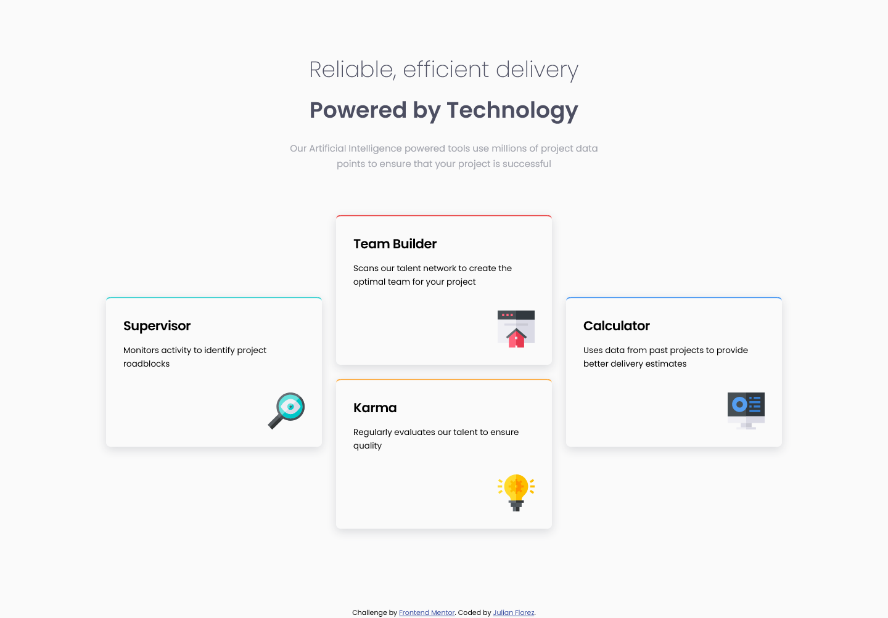

</img>

<h1 align="center">Four card feature sectionchallenge</h1>

  <h3>
    <a href="https://juliflorezg.github.io/10_four_card_feature_section/">
      Live site
    </a>
     | 
    <a href="https://www.frontendmentor.io/solutions/second-attempt-to-four-card-section-challenge-oQxBAjPGA">
      Solution
    </a>
    | 
    <a href="https://www.frontendmentor.io/challenges/four-card-feature-section-weK1eFYK">
      Challenge
    </a>
  </h3>

   Solution for a challenge from  <a href="https://www.frontendmentor.io/" target="_blank">frontendmentor.io</a>.

 
 
 

## About The Project

Simple card component for practicing HTML + CSS, using multicolumn responsive layout.

 
  
I don't have access to the Figma sketch so the design is not pixel perfect.

## Built with

- Semantic HTML5 markup
- SASS for the CSS styles
- Use of gulp for compiling and minifying the html & css files and generate sourcemap files, I also added the prefixes for various browsers using postCSS
- Flexbox & Grid
- Mobile-first workflow

## Acknowledgments

A big thank you to anyone providing feedback on my <a href="">solution</a>. It definitely helps to find new ways to code and find easier solutions!